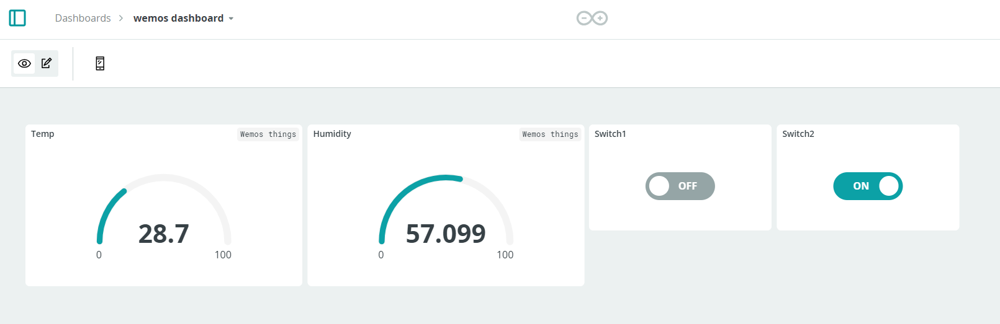

# Arduino IoT Cloud Dashboard Configuration: Wemos Dashboard

This document provides a detailed overview of the configuration settings for the "Wemos Dashboard" in the Arduino IoT Cloud, including widgets and associated cloud variables.

## Dashboard Overview

The "Wemos Dashboard" is configured to display the temperature and humidity readings from sensors connected to a LOLIN (WEMOS) D1 R2 & mini device, and control two switches (`Switch1` and `Switch2`).

### Widgets

1. **Temp Gauge**
   - **Type**: Gauge
   - **Linked Variable**: `wemos_temp`
   - **Description**: Displays the temperature reading from the Wemos device.
   - **Range**: 0 to 100
   - **Last Value**: 28.7 (as of the last update)

2. **Humidity Gauge**
   - **Type**: Gauge
   - **Linked Variable**: `wemos_hum`
   - **Description**: Displays the humidity reading from the Wemos device.
   - **Range**: 0 to 100
   - **Last Value**: 57.099 (as of the last update)

3. **Switch1**
   - **Type**: Toggle Switch
   - **Linked Variable**: `light_1`
   - **Description**: Controls the first light switch on the Wemos device.
   - **State**: OFF (as of the last update)
   - **Cloud Variable Value**: `false`

4. **Switch2**
   - **Type**: Toggle Switch
   - **Linked Variable**: `light_2`
   - **Description**: Controls the second light switch on the Wemos device.
   - **State**: ON (as of the last update)
   - **Cloud Variable Value**: `true`

### Cloud Variables

1. **wemos_temp**
   - **Type**: `CloudTemperatureSensor`
   - **Description**: Captures the temperature data from the sensor connected to the Wemos device.
   - **Last Value**: 29.4 (as of 30 Aug 2024, 16:13:27)

2. **wemos_hum**
   - **Type**: `CloudTemperatureSensor`
   - **Description**: Captures the humidity data from the sensor connected to the Wemos device.
   - **Last Value**: 56.2 (as of 30 Aug 2024, 16:13:36)

3. **light_1**
   - **Type**: `CloudSwitch`
   - **Description**: Represents the state of the first light switch.
   - **Last Value**: `false` (as of 30 Aug 2024, 16:02:21)

4. **light_2**
   - **Type**: `CloudSwitch`
   - **Description**: Represents the state of the second light switch.
   - **Last Value**: `true` (as of 30 Aug 2024, 16:02:16)

### Associated Device

- **Device Name**: Barbaraanne
- **Device Type**: LOLIN(WEMOS) D1 R2 & mini
- **Status**: Online
- **Wi-Fi Network**: `iotnet`

### Notes

- The gauges for temperature and humidity update dynamically based on the sensor readings from the Wemos device.
- The toggle switches (`Switch1` and `Switch2`) are used to control external devices connected to the Wemos board.
- Make sure the cloud variables are correctly linked in the dashboard to ensure proper functionality and real-time updates.
